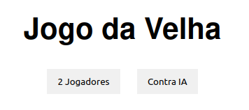
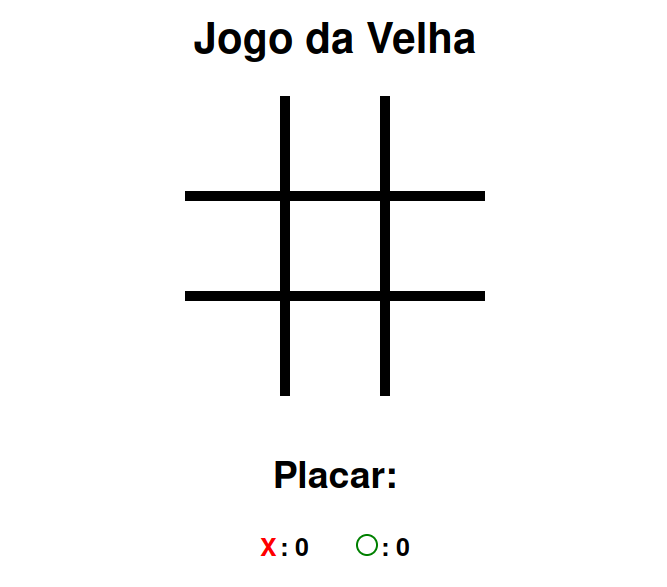

<h1 align="center">
  
</h1>

  <a href="#-tecnologias">Tecnologias</a>&nbsp;&nbsp;&nbsp;|&nbsp;&nbsp;&nbsp;
  <a href="#-projeto">Projeto</a>&nbsp;&nbsp;&nbsp;

 

  

## 🚀 Tecnologias

Esse projeto foi desenvolvido com as seguintes tecnologias:

- HTML
- CSS
- JavaScript

## 💻 Projeto

O jogo da velha é um dos projetos do curso "JS do básico ao avançado", realizado através da plataforma Udemy e ministrado pelo Matheus Battisti, a idéia é consolidar os conhecimentos repassados no curso, utilizando HTML5 básico, CSS3 básico e trabalhar com a manipulação do DOM com JS. Desenvolvemos também uma IA que joga de forma aleatória.

---

Feito com 💜 👋 [Check out my LinkedIn](https://www.linkedin.com/in/william-souza-0967337b/)